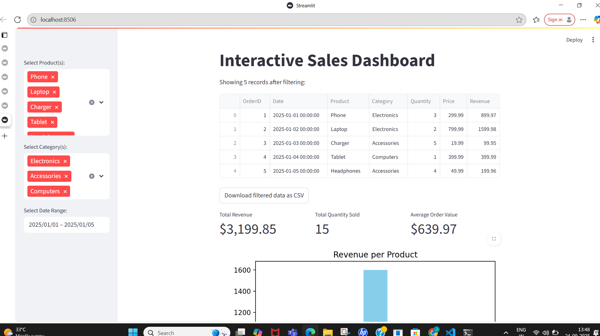

 Streamlit Sales Dashboard

An interactive data dashboard built with Streamlit and Python for sales analysis.

 Features
- Filter sales by product, category, and date range
- View KPIs: Total Revenue, Total Quantity Sold, Average Order Value
- Interactive charts: bar (revenue per product), pie (category share), line (daily revenue trend)
- Export filtered data as CSV

 Screenshot

How to Run

1. Install requirements:  
   `pip install streamlit pandas matplotlib`
2. Run the app:  
   `streamlit run dashboard.py`
3. The dashboard opens in your browser.

 About

This project demonstrates beginner-intermediate data analysis and visualization skills with Python and Streamlit.

